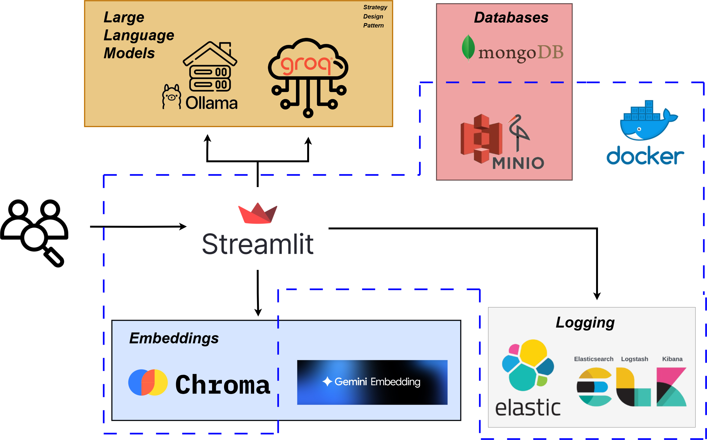

# AI Talent Scout

AI Talent Scout is a comprehensive Streamlit-based web application designed to streamline the process of managing, searching, and analyzing candidate resumes using advanced LLMs (Large Language Models), MongoDB, MinIO, and vector search with ChromaDB. The app features resume extraction, semantic search, CSV export, skills management, and intelligent candidate matching.

---

## Features

- **Resume Upload & Extraction**: Upload PDF resumes, extract structured candidate data using LLMs (Groq LLaMA 3.3 or local Ollama), and store them in MongoDB.
- **Semantic Skill Matching**: Uses ChromaDB and Google Generative AI embeddings to deduplicate and match skills, supporting fuzzy/semantic search.
- **Candidate Search & Chat**: Query the candidate database using natural language, with LLMs generating MongoDB queries for flexible search.
- **CSV Export**: View and export candidate summaries as CSV.
- **Resume Library**: Browse, preview, and download all uploaded resumes.
- **Skills Management**: Comprehensive interface to manage, add, remove, and synchronize skills across MongoDB and ChromaDB.
- **MinIO Integration**: Store and retrieve PDF files securely.
- **Intelligent Skill Processing**: Automatic skill normalization, similarity detection, and database synchronization.

---

## Tech Stack

- **Frontend**: [Streamlit](https://streamlit.io/)
- **Backend**: Python 3.12
- **Database**: MongoDB
- **Object Storage**: MinIO
- **Vector Search**: ChromaDB + Google Generative AI Embeddings
- **LLMs**: Groq API (LLaMA 3.3), Ollama (local)

  
*AI Talent Scout Global Architecture*
**For the ELK stack check the "main-with-elk" branch**


## Project Structure

```
Stage2A_1/
├── main.py                          # Main application entry point
├── pages/                           # Streamlit page modules
│   ├── chatPage.py                  # AI-powered candidate search interface
│   ├── upload_resumePage.py         # Resume upload and processing
│   ├── csvPage.py                   # CSV export and candidate viewing
│   ├── listResume.py                # Resume library and browsing
│   └── skillsManagementPage.py      # Skills management interface
├── services/                        # Business logic services
│   ├── llm_service.py              # LLM integration and processing
│   └── dictionaire_service.py      # Skills dictionary management
├── clients/                         # Database and storage clients
│   ├── mongo_client.py             # MongoDB operations
│   └── minio_client.py             # MinIO file storage
├── llms/                           # LLM client implementations with strategy pattern
│   ├── groqClient.py               # Groq API integration
│   ├── ollamaClient.py             # Local Ollama integration
│   └── llmClientABC.py             # Abstract base class
├── embeddings/                     # Vector search and embeddings
│   ├── chroma_gemini_embedding.py  # ChromaDB + Google AI integration
│   └── google_langchain_chroma_Adapter.py
├── utils.py                        # Utility functions
├── docker-compose.yml              # MinIO service configuration
```

---

## Getting Started

### Prerequisites

- Docker & Docker Compose
- Python 3.12 (for local development)
- MongoDB instance (local or cloud)
- API keys for Groq, Google Generative AI
- Ollama (for local LLM processing)

### Environment Variables

Create a `.env` file in the project root with the following variables:

```env
MINIO_ENDPOINT=localhost:9000
MINIO_ROOT_USER=your_minio_user
MINIO_ROOT_PASSWORD=your_minio_password
MONGO_ENDPOINT=mongodb://your_mongo_uri
GOOGLE_API_KEY=your_google_api_key
CHROMA_GOOGLE_GENAI_API_KEY=your_google_api_key
GROQ_API_KEY=your_groq_api_key
```

### Running with Docker Compose

```bash
# Install dependencies
pip install -r requirements.txt

#Launch Minio object storage
docker-compose up -d

# Run the application
streamlit run main.py
```

- The app will be available at [http://localhost:8501](http://localhost:8501)
- MinIO Console: [http://localhost:9001](http://localhost:9001)


## Workflow Overview

The AI Talent Scout system follows this comprehensive workflow:

1. **Resume Upload** → PDF text extraction using PyPDF2
2. **AI Processing** → LLM analysis and structured data extraction
3. **Skills Processing** → Automatic skill normalization and similarity matching
4. **Data Storage** → MongoDB for profiles, MinIO for PDFs, ChromaDB for embeddings
5. **Search & Matching** → Natural language queries converted to MongoDB queries
6. **Export & Analysis** → CSV export and detailed candidate viewing
7. **Skills Management** → Centralized skills dictionary management and synchronization

## Usage

### Upload Resume
1. Navigate to the "Upload Page"
2. Select one or more PDF resumes
3. Choose your preferred LLM (Groq API or local Ollama)
4. The app will extract structured data and store it in MongoDB and MinIO
5. Skills are automatically deduplicated and matched using semantic search

### Chat Search
1. Go to the "Chat Page"
2. Select your preferred LLM client
3. Ask questions in natural language, such as:
   - "Show me Python developers with 5+ years experience"
   - "Find candidates who know React and have worked with AWS"
   - "Who has experience in machine learning and data science?"
4. The LLM generates MongoDB queries and returns matching candidates
5. Download candidate resumes directly from the results

### CSV Export
1. Visit the "CSV Table" page
2. Search and filter candidates by name, email, role, or summary
3. View a comprehensive table of all candidates
4. Download the data as a CSV file for external analysis

### Resume Library
1. Access the "Resume Library" page
2. Browse all uploaded resumes with PDF preview
3. Search candidates by various criteria
4. Download individual resumes as needed

### Skills Management
1. Navigate to the "Skills Management" page
2. **View Skills**: Browse all current skills with search and filter capabilities
3. **Add Skills**: Add individual skills or bulk import multiple skills
4. **Remove Skills**: Select and remove unwanted skills from both databases
5. **Database Sync**: Check synchronization status between MongoDB and ChromaDB
6. **Force Sync**: Resolve any database inconsistencies
7. **Export Skills**: Download skills data as CSV for external use


## Key Features & Capabilities

### AI-Powered Resume Processing
- **Intelligent Extraction**: LLMs extract structured data from PDF resumes
- **Skill Normalization**: Automatic skill matching and deduplication
- **Semantic Search**: Find similar skills using vector embeddings
- **Flexible LLM Options**: Choose between cloud (Groq) and local (Ollama) processing

### Database Management
- **MongoDB**: Stores candidate profiles and extracted data
- **ChromaDB**: Vector database for skill similarity search
- **MinIO**: Secure file storage for original PDFs
- **Automatic Sync**: Ensures consistency between all databases

### Advanced Search & Matching
- **Natural Language Queries**: Ask questions in plain English
- **Smart Filtering**: AI-generated MongoDB queries for precise results
- **Resume Download**: Direct access to candidate PDFs
- **Export Capabilities**: CSV export for external analysis

## Development & Contributing

### Code Structure
The application follows a modular architecture:
- **Pages**: Streamlit UI components for different functionalities
- **Services**: Business logic and LLM processing
- **Clients**: Database and external service integrations
- **LLMs**: Abstracted language model interfaces
- **Embeddings**: Vector search and similarity matching

## Skills Management System

The Skills Management page provides comprehensive control over the skills dictionary:

### Core Functionality
- **Skills Viewing**: Browse all skills with search and filter capabilities
- **Bulk Operations**: Add/remove multiple skills simultaneously
- **Database Synchronization**: Ensure MongoDB and ChromaDB consistency
- **Export Capabilities**: Download skills data for external analysis


## Conclusion

AI Talent Scout represents a modern approach to resume management and candidate discovery, combining the power of Large Language Models with intelligent database management and vector search capabilities. The system provides a comprehensive solution for organizations looking to streamline their recruitment processes while maintaining data quality and consistency.


